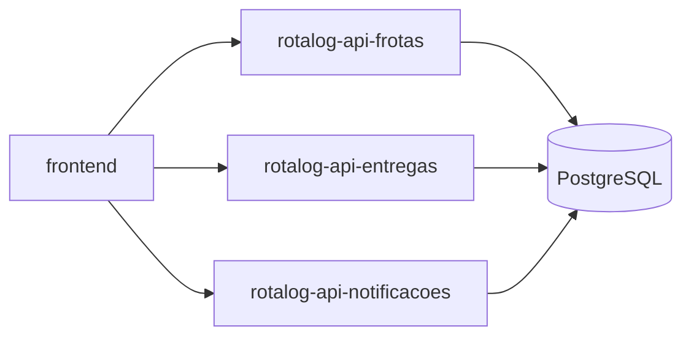

# Plan – Meta‑Repository with Git Submodules

**Goal**: Create a top‑level *rotalog* repository that references each service repository (`rotalog-api-frotas`, `rotalog-api-entregas`, `rotalog-api-notificacoes`, `rotalog-workspace`, `rotalog-frontend`) as Git submodules. All five repositories must first be created in your personal GitHub account (`https://github.com/bpinheiromg`). The meta‑repo will also host shared documentation and a unified CI workflow.

---

## 1. Repository layout
```
rotalog/                     ← meta‑repo (new GitHub repo)
├─ .gitmodules               ← submodule definitions (will include branch = main)
├─ .gitignore                ← ignore accidental full‑tree commits of submodule contents
├─ README.md                 ← overview, clone instructions, CI badge
├─ docs/
│   └─ architecture.md       ← system diagram, service interactions
├─ docs/plans/               ← this plan lives here
├─ rotalog-api-frotas/               ← submodule → rotalog-api-frotas (Java/Spring)
├─ rotalog-api-entregas/             ← submodule → rotalog-api-entregas (Node/Express)
├─ rotalog-api-notificacoes/         ← submodule → rotalog-api-notificacoes (Java/Spring)
├─ rotalog-workspace/                ← submodule → rotalog-workspace (Nx utilities)
└─ rotalog-frontend/                 ← submodule → rotalog-frontend (Nx – Angular + React)
```

## 2. Create the five GitHub repositories (personal)
| Service | Repository URL (to create) |
|---------|----------------------------|
| `rotalog-api-frotas` | `https://github.com/bpinheiromg/rotalog-api-frotas.git` |
| `rotalog-api-entregas` | `https://github.com/bpinheiromg/rotalog-api-entregas.git` |
| `rotalog-api-notificacoes` | `https://github.com/bpinheiromg/rotalog-api-notificacoes.git` |
| `rotalog-workspace` | `https://github.com/bpinheiromg/rotalog-workspace.git` |
| `rotalog-frontend` | `https://github.com/bpinheiromg/rotalog-frontend.git` |

For each entry:
1. Go to GitHub, click **New repository**.
2. Use the exact name shown above.
3. **Do not** initialize with a README, .gitignore, or license (we’ll push from the local side).
4. After creation, you will have an empty remote URL ready for the submodule command.
5. **Push the existing local service code to the new remote** (see step 3 b).

## 3. Initialise the meta‑repo locally (if not already a Git repo)
```bash
cd "D:/OneDrive/Saves Jogos/Projetos/rotalog"
# Initialise a new Git repository (if .git does not exist)
if [ ! -d .git ]; then git init; fi
```

### 3 b. Push each local service repository to its remote (first commit)
For every service folder that already exists locally (cloned from the course):
```bash
# Example for rotalog-api-frotas
cd rotalog-api-frotas
git init                # initialise a Git repo inside the folder (if not already)
git remote add origin https://github.com/bpinheiromg/rotalog-api-frotas.git
git add .
git commit -m "Initial commit of rotalog-api-frotas"
git push -u origin main
cd ..
```
Repeat the same steps for `rotalog-api-entregas`, `rotalog-api-notificacoes`, `rotalog-workspace`, and `rotalog-frontend` (adjust the remote URL accordingly). This ensures each submodule has a valid commit that the meta‑repo can point to.

## 4. Add each local folder as a **Git submodule** pointing to the personal remote
Because the directories already contain the service code, we use `--force` to let Git replace the working‑tree contents with the submodule checkout (the previous push guarantees the remote has a commit to check out).
```bash
# Replace <you> with your GitHub username (bpinheiromg)
git submodule add --force https://github.com/bpinheiromg/rotalog-api-frotas.git rotalog-api-frotas
git submodule add --force https://github.com/bpinheiromg/rotalog-api-entregas.git rotalog-api-entregas
git submodule add --force https://github.com/bpinheiromg/rotalog-api-notificacoes.git rotalog-api-notificacoes
git submodule add --force https://github.com/bpinheiromg/rotalog-workspace.git rotalog-workspace
git submodule add --force https://github.com/bpinheiromg/rotalog-frontend.git rotalog-frontend
```
**Note:** `--force` will overwrite the existing folder contents with the submodule’s checkout. Since we have already pushed the exact same code in step 3 b, nothing is lost.

## 5. Initialise and update submodules
```bash
git submodule init
git submodule update --remote --recursive
```
This creates the `.gitmodules` file and checks out the recorded commit for each submodule.

## 6. Ensure submodule entries specify the default branch
Edit `.gitmodules` (or add it now) so each submodule includes the branch you will use (typically `main`):
```ini
[submodule "rotalog-api-frotas"]
    path = rotalog-api-frotas
    url = https://github.com/bpinheiromg/rotalog-api-frotas.git
    branch = main

[submodule "rotalog-api-entregas"]
    path = rotalog-api-entregas
    url = https://github.com/bpinheiromg/rotalog-api-entregas.git
    branch = main

[submodule "rotalog-api-notificacoes"]
    path = rotalog-api-notificacoes
    url = https://github.com/bpinheiromg/rotalog-api-notificacoes.git
    branch = main

[submodule "rotalog-workspace"]
    path = rotalog-workspace
    url = https://github.com/bpinheiromg/rotalog-workspace.git
    branch = main

[submodule "rotalog-frontend"]
    path = rotalog-frontend
    url = https://github.com/bpinheiromg/rotalog-frontend.git
    branch = main
```
You can edit the file manually or run:
```bash
git config -f .gitmodules submodule.rotalog-api-frotas.branch main
# repeat for the other submodules
```

## 7. Add a top‑level `.gitignore` to protect against accidental full‑tree commits
```bash
cat > .gitignore <<'EOF'
# Prevent committing the entire submodule contents by mistake
rotalog-api-frotas/
rotalog-api-entregas/
rotalog-api-notificacoes/
rotalog-workspace/
rotalog-frontend/
EOF
```
The submodule gitlinks are still tracked; the ignore only affects untracked files inside those directories.

## 8. Add top‑level documentation (optional but recommended)
```bash
# README
cat > README.md <<'EOF'
# Rotalog – Meta‑Repository

This repository aggregates the five services that compose the Rotalog system:

* **rotalog-api-frotas** – Java / Spring Boot (vehicle & routing)
* **rotalog-api-entregas** – Node / Express (delivery dispatch)
* **rotalog-api-notificacoes** – Java / Spring Boot (notifications)
* **rotalog-workspace** – Nx utilities & shared scripts
* **rotalog-frontend** – Nx monorepo (Angular 18 + React 18)

## Cloning
```bash
git clone --recurse-submodules https://github.com/bpinheiromg/rotalog.git
cd rotalog
```

## Building / testing
See the CI workflow (`.github/workflows/ci.yml`) for the exact commands for each submodule.
EOF
```
Create a simple architecture diagram:
```bash
mkdir -p docs && cat > docs/architecture.md <<'EOF'

EOF
```

## 9. Add a unified **GitHub Actions** CI workflow
```bash
mkdir -p .github/workflows && cat > .github/workflows/ci.yml <<'EOF'
name: CI – Rotalog Suite
on:
  push:
    branches: [ main ]
  pull_request:
    branches: [ main ]

jobs:
  checkout:
    runs-on: ubuntu-latest
    steps:
      - name: Checkout repo with submodules
        uses: actions/checkout@v4
        with:
          submodules: true

      # ---------- Java services ----------
      - name: Set up Java 11
        uses: actions/setup-java@v4
        with:
          distribution: temurin
          java-version: '11'

      - name: Build rotalog-api-frotas
        working-directory: ./rotalog-api-frotas
        run: mvn clean install

      - name: Build rotalog-api-notificacoes
        working-directory: ./rotalog-api-notificacoes
        run: mvn clean install

      # ---------- Node/Express service ----------
      - name: Set up Node
        uses: actions/setup-node@v4
        with:
          node-version: '20'

      - name: Install & test rotalog-api-entregas
        working-directory: ./rotalog-api-entregas
        run: |
          npm ci
          npm test

      # ---------- Workspace utilities (optional) ----------
      - name: Install & lint workspace (if present)
        working-directory: ./rotalog-workspace
        run: |
          npm ci
          npm run lint
        continue-on-error: true

      # ---------- Front‑end (Nx) ----------
      - name: Install Nx workspace dependencies
        working-directory: ./rotalog-frontend
        run: npm ci

      - name: Build all frontend apps
        working-directory: ./rotalog-frontend
        run: npx nx run-many --target=build --all

      - name: Run Jest + Playwright tests
        working-directory: ./rotalog-frontend
        run: npx nx affected --target=test
EOF
```

## 10. Commit the changes and push the meta‑repo
```bash
git add .gitmodules .gitignore README.md docs/ .github/workflows/ci.yml
git commit -m "Add all five services as submodules (full names), docs, .gitignore, and CI workflow"
# Create the meta‑repo on GitHub (if not yet created) then add it as remote
git remote add origin https://github.com/bpinheiromg/rotalog.git
git push -u origin main
```

## 11. Verify on GitHub
* Open the `rotalog` repo in a browser – each submodule folder should display as a submodule link.
* Check the **Actions** tab – the CI run should start automatically.

## 12. Ongoing submodule updates (future)
When any service repo receives new commits:
```bash
cd <submodule-dir>
git pull origin main
cd ..
git add <submodule-dir>
git commit -m "Update <submodule-dir> to latest"
git push
```
This updates the pointer in the meta‑repo and triggers CI again.

---

**Next steps**
1. Create the five personal GitHub repositories listed in section 2.
2. Run the commands in sections 3 b‑10 to set up the meta‑repo.
3. Verify the CI workflow passes.
4. Reach out if you encounter any issues.
